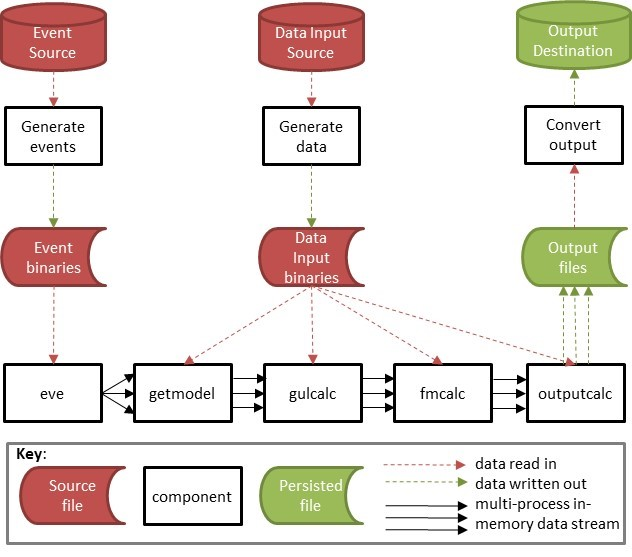

# Introduction
This paper describes the in-memory harness developed for Oasis R1.5.  Full details and the code are available in a private GitHub for Oasis Members.

The paper provides some Background, a short Overview, the Specification, the Reference Model implementation and a short Planned work section.

### Background

The in-memory solution for the Oasis Monte-Carlo sampling of damage calculations (including financial module and simple outputs) is called the kernel tools or “ktools”.
The origin of ktools is that a secure compilable version of the kernel calculation in Oasis was needed for the Oasis Solutions Project so this gave the team the opportunity to bring forward the always planned C-based calculation option.  This is timely as the existing SQL-based Oasis provides a comparison calculation and also has full audit trails, so that it can be used to check that the compute engine of ktools is giving correct answers.
ktools is an independent “specification” of a set of processes which means that it defines the processing architecture and data structures and is then implemented as “reference model” which can then be adapted for particular model or business needs.  For example, we have a related project for the implementation into Oasis called "oatools" (see 'Related projects' below).

Release 1.3 (and later releases) includes an “in-memory” version of the Oasis central calculations (termed the “Kernel”) written in C++ and C to provide streamed calculation at high computational performance.  Prior releases of Oasis used SQL-based back-ends with SQL code generated by the mid-tier libraries.  The new variant was delivered as a stand-alone toolkit with R1.4 and in future releases, the compiled code will be distributed by the mid-tier.

### Architecture

The Kernel is provided as a toolkit of components (“ktools”) which can be invoked at the command line.  Each component is a separately compiled executable with a binary data stream of inputs and outputs.  
The principle is to stream data through by event end-to-end, with multiple processes being used either sequentially or concurrently, at the control of the user using a script file appropriate to the operating system.

### Language

The components can be written in any language as long as the data structures of the binary streams are adhered to.  The current set of components have been written in POSIX-compliant C++ and C.  This means that they can be compiled in Linux and Windows using the GNU compiler toolchain.

### Components

The set of components in the Reference Model provided in this release is as follows;
* **eve** is the process distributing utility. Based on the number of events in the input and the number of processes specified as a parameter, eve distributes the events to the processes. The output streams into getmodel.
* **getmodel** is a CDF plug-in to generate the CDFs for a specified list of events. It is the reference example of a plug-in using Oasis kernel format data in binary format. getmodel streams into gulcalc or can be output to a binary file.
* **gulcalc** is the core component which performs the GUL sampling calculations and numerical integration. The output is the Oasis format gul results table. This can be output to a binary file or streamed into another plug-in component, such as a Financial Module or output calculation.
* **fmcalc** is the core component which performs the insured loss calculations from the input ground up loss samples. It has the same functionality as the Oasis Financial Module.  The output is the Oasis format FM results table. This can be output to a binary file or streamed into an output calculation.
* **outputcalc** performs results analysis on the ground up loss or insured loss samples, and exports the results table to a csv file. The example given produces an event loss table.
* **cdftocsv** is a utility to output binary format CDFs to a csv.
* **gultocsv** is a utility to output binary format GULs to a csv.
* **fmtocsv** is a utility to output binary format losses to a csv. 

### Usage

Standard piping syntax can be used to invoke the components at the command line. For example the following command invokes eve, getmodel, gulcalc, fmcalc, and outputcalc, and exports the results to a csv file.
``` sh
$ eve 1 1 2 | getmodel 1 | gulcalc –S100 –C1 | fmcalc | outputcalc > output.csv
```

Example bash shell, python and vbs scripts are provided along with a binary data package in the /examples folder to demonstrate usage of the toolkit.

### Related projects
[oatools](https://github.com/OasisLMF/oatools) is a related (private) github project containing additional components which are specific to an implementation of the in-memory kernel in Oasis. 

Specifically, it contains a component **gendata** that generates the input data required for the in-memory calculations as binary files, reading from an Oasis SQL Server back-end database. In order to generate the package of executables for the Oasis implementation it is necessary to first build ktools in Windows, and then build oatools in Windows. 

gendata is an example of another class of components for extracting data to create the binary input files required by ktools, which is principally just the calculation componentware. It is planned to provide utilities which convert input data in csv format to binary format as part of the reference model, to make it easier for developers to import their data into ktools. 

# Data Streaming Framework Overview

This is the general data streaming framework showing the main components of the toolkit.

##### Figure 1. Data streaming framework


The in-memory data streams are initiated by the process 'eve' (meaning 'event emitter' rather than in the biblical sense) and shown by solid arrows. The read/write data flows are shown as dashed arrows. Multiple arrows mean multiple processes. 

The calculation components are *getmodel*, *gulcalc*, *fmcalc* and *outputcalc*. Each has its own internal data requirements and in the reference model provided with this specification, and displayed in Figure 1, the internal data inputs come from the same source.  
However all components are plug-and-play, so the internal data for each can be retrieved from independent external sources. 

The standard workflow is straight through in-memory processing to produce a single output file.  This minimises the amount of disk I/O at each stage and results in the best performance. This workflow is shown in Figure 2.

##### Figure 2. Straight-through processing


However it is possible to write the results of each calculation to a binary file, if the data is required to be persisted. This workflow is shown in Figure 3.
At present, intermediate results binaries are required to be read back into memory for downstream calculations.

##### Figure 3. Multiple output file processing


The reference model demonstrates an implementation of the principal calculation components, along with some data conversion components which convert binary files to csv files. 

# Specification

### Introduction

This section specifies the components and data stream structures in the in-memory kernel.

Most components have a standard input (stdin) and output (stdout) data stream structure. These data structures are not defined explicitly as meta data in the code as they would be in a database language, and they have been designed to minimise the volume flowing through the pipeline. For example, indexes which are common to a block of data are defined as a header record and then only the variable data records that are relevant to the header key are part of the data stream. The names of the data fields given below are unimportant, only their position in the data stream in order to perform the calculations defined in the program.

#### Stream types

The architecture supports multiple stream types. Therefore a developer can define a new type of data stream within the framework by specifying a unique stream_id of the stdout of one or more of the components, or even write a new component which performs an intermediate calculation between the existing components.

The stream_id is the first 4 byte header of the stdout streams. The higher byte is reserved to identify the type of stream, and the 2nd to 4th bytes hold the identifier of the stream.

The current reserved values are as follows;

Higher byte;

| Byte 1 |  Stream type   |
|:-------|:---------------|
|    0   | getmodel       |
|    1   | gulcalc        |
|    2   | fmcalc         |

Reserved stream_ids;

| Byte 1 | Bytes 2-4 |  Description                                                        		 |
|:-------|-----------|:--------------------------------------------------------------------------|
|    0   |     1     |  getmodel - Reference example for Oasis format CDF output                 |
|    1   |     1     |  gulcalc - Reference example for Oasis format ground up loss sample output|
|    2   |     1     |  fmcalc - Reference example for Oasis format insured loss sample output   |

The final calculation component, outputcalc, has no stream_id as it outputs results directly to csv.

There are rules about which stream types can be accepted as inputs to the components. These are;
* gulcalc can only take stream type 0 (getmodel standard output) as input
* fmcalc can only take stream type 1 (gulcalc standard output) as input
* outputcalc can take either stream type 1 (gulcalc standard output) or 2 (fmcalc standard output) as input

#### eve

eve is an 'event emitter' and its job is to read a list of events from file and send out a subset of events as a binary data stream. It has no standard input. 
eve is used to partition lists of events such that a workflow can be distributed across multiple processes.

##### Output

Data packet structure

| Name              | Type   |  Bytes | Description                                                         | Example     |
|:------------------|--------|--------| :-------------------------------------------------------------------|------------:|
| event_id          | int    |    4   | Oasis event_id                                                      |   4545      |

Note that eve has no stream_id header.

#### getmodel

getmodel is the component which generates a stream of cdfs for a given set of event_ids. 

##### Input
Same as eve output or a binary file of the same input format can be piped into getmodel.

##### Output
Header packet structure

| Name              | Type   |  Bytes | Description                                                         | Example     |
|:------------------|--------|--------| :-------------------------------------------------------------------|------------:|
| stream_id         | int    |   1/3  | Identifier of the data stream type.                                 |    0/1      |
| event_id          | int    |    4   | Oasis event_id                                                      |   4545      |
| areaperil_id      | int    |    4   | Oasis areaperil_id                                                  |  345456     |
| vulnerability_id  | int    |    4   | Oasis vulnerability_id                                              |   345       |
| no_of_bins        | int    |    4   | Number of records (bins) in the data package                        |    20       |        

Data packet structure (record repeated no_of_bin times)

| Name              | Type   |  Bytes | Description                                                         | Example     |
|:------------------|--------|--------| :-------------------------------------------------------------------|------------:|
| prob_to           | float  |    4   | The cumulative probability at the upper damage bin threshold        |     0.765   |
| bin_mean          | float  |    4   | The conditional mean of the damage bin                              |     0.45    |

#### gulcalc

gulcalc is the component which calculates ground up loss. It takes the cdfs as standard input and based on the sampling parameters specified, performs Monte Carlo sampling and numerical integration. The output is a table of ground up loss samples in Oasis kernel format, with mean (sidx=0) and standard deviation (sidx=-1).

##### Input
Same as getmodel output or a binary file of the same data structure can be piped into gulcalc.

##### Output
Stream header packet structure

| Name              | Type   |  Bytes | Description                                                         | Example     |
|:------------------|--------|--------| :-------------------------------------------------------------------|------------:|
| stream_id         | int    |   1/3  | Identifier of the data stream type.                                 |    1/1      |
| no_of_samples     | int    |   4    | Number of samples                                                   |    100      |

Gul header packet structure

| Name              | Type   |  Bytes | Description                                                         | Example     |
|:------------------|--------|--------| :-------------------------------------------------------------------|------------:|
| event_id          | int    |    4   | Oasis event_id                                                      |   4545      |
| item_id           | int    |    4   | Oasis item_id                                                       |    300      |

Gul data packet structure

| Name              | Type   |  Bytes | Description                                                         | Example     |
|:------------------|--------|--------| :-------------------------------------------------------------------|------------:|
| sidx              | int    |   1/3  | Sample index                                                        |    0/10     |
| gul               | float  |    4   | The ground up loss for the sample                                   | 5675.675    |

The data packet may be a variable length and so an sidx of 0/0 identifies the end of the data packet.

The 4 byte sidx field has a structure similar to the stream_id, in that the higher byte is reserved to have a special meaning, and bytes 2-4 hold the identifier.
The higher byte reserved values are;

| Byte 1 |  Meaning                  |
|:-------|:--------------------------|
|    0   | normal sample (sidx>0)    |
|    1   | mean / standard deviation |

The sidx reserved values are;

| Byte 1 | Bytes 2-4 |  Description              |
|:-------|-----------|:--------------------------|
|    1   |     0     |  mean                     |
|    1   |     -1    |  standard deviation       |
|    0   |     0     |  data packet terminator   |

A normal sample index starts at 1 and has a higher byte of 0. For example, the sidx for sample 100 is stored as 0/100.

#### fmcalc

fmcalc is the component which takes the gulcalc output stream as standard input and applies the policy terms and conditions to produce insured loss samples. The output is a table of insured loss samples in Oasis kernel format, including the insured loss for the mean ground up loss (sidx=0).

##### Input
Same as gulcalc output or a binary file of the same data structure can be piped into fmcalc.

##### Output
Stream Header packet structure

| Name              | Type   |  Bytes | Description                          | Example     |
|:------------------|--------|--------| :------------------------------------|------------:|
| stream_id         | int    |   1/3  | Identifier of the data stream type.  |    2/1      |
| no_of_samples     | int    |   4    | Number of samples                    |    100      |

fmcalc header packet structure

| Name              | Type   |  Bytes | Description                          | Example     |
|:------------------|--------|--------| :------------------------------------|------------:|
| event_id          | int    |    4   | Oasis event_id                       |   4545      |
| prog_id           | int    |    4   | Oasis prog_id                        |    300      |
| layer_id          | int    |    4   | Oasis layer_id                       |    300      |
| output_id         | int    |    4   | Oasis output_id                      |    300      |

fmcalc data packet structure

| Name              | Type   |  Bytes | Description                          | Example     |
|:------------------|--------|--------| :------------------------------------|------------:|
| sidx              | int    |   1/3  | Sample index                         |    0/10     |
| loss              | float  |    4   | The insured loss for the sample      | 5625.675    |

The data packet may be a variable length and so a sidx of 0/0 identifies the end of the data packet.

The sidx field is the same as the sidx in the gul stdout stream. 

#### outputcalc

outputcalc is the component which performs results analysis such as an event loss table or EP curve on the sampled output from either the gulcalc or fmcalc program.  The output is a results table in csv format.

##### Input
gulcalc stdout or fmcalc stdout. Binary files of the same data structures can be piped into outputcalc.

##### Output
No standard output stream. The results table is exported to a csv file. See the [Reference model](ReferenceModel.md) for example output.

#### cdftocsv

A component which converts the getmodel output stream, or binary file with the same structure, to a csv file.

##### Input
Same as getmodel output or a binary file of the same format can be piped into cdftocsv.

##### Output
Csv file with the following fields;

| Name              | Type   |  Bytes | Description                                                         | Example     |
|:------------------|--------|--------| :-------------------------------------------------------------------|------------:|
| event_id          | int    |    4   | Oasis event_id                                                      |   4545      |
| areaperil_id      | int    |    4   | Oasis areaperil_id                                                  |  345456     |
| vulnerability_id  | int    |    4   | Oasis vulnerability_id                                              |   345       |
| bin_index         | int    |    4   | Damage bin index                                                    |    20       | 
| prob_to           | float  |    4   | The cumulative probability at the upper damage bin threshold        |   0.765     |
| bin_mean          | float  |    4   | The conditional mean of the damage bin                              |   0.45      |

#### gultocsv

A component which converts the gulcalc output stream, or binary file with the same structure, to a csv file.

##### Input
Same as gulcalc output or a binary file of the same format can be piped into gultocsv.

##### Output
Csv file with the following fields;

| Name              | Type   |  Bytes | Description                                                         | Example     |
|:------------------|--------|--------| :-------------------------------------------------------------------|------------:|
| event_id          | int    |    4   | Oasis event_id                                                      |   4545      |
| item_id           | int    |    4   | Oasis item_id                                                       |    300      |
| sidx              | int    |    4   | Sample index                                                        |     10      |
| gul               | float  |    4   | The ground up loss value                                            | 5675.675    |

#### fmtocsv

A component which converts the fmcalc output stream, or binary file with the same structure, to a csv file.

##### Input
Same as fmcalc output or a binary file of the same format can be piped into fmtocsv.

##### Output
Csv file with the following fields;

| Name              | Type   |  Bytes | Description                                                         | Example     |
|:------------------|--------|--------| :-------------------------------------------------------------------|------------:|
| event_id          | int    |    4   | Oasis event_id                                                      |   4545      |
| prog_id           | int    |    4   | Oasis prog_id                                                       |    1        |
| layer_id          | int    |    4   | Oasis layer_id                                                      |    1        |
| output_id         | int    |    4   | Oasis output_id                                                     |    5        |
| sidx              | int    |    4   | Sample index                                                        |    10       |
| loss              | float  |    4   | The insured loss value                                              | 5375.675    |

# Reference Model

This section provides an explanation of the reference model, which is an implementation of each of the components in the framework. 

The set of core components provided in this release is as follows;
* **eve** is the event distributing utility. Based on the number of events in the input and the number of processes specified as a parameter, eve outputs subsets of the events as a stream. The output streams into getmodel.
* **getmodel** generates a stream of effective damageability cdfs for the input stream of events. The reference example reads in Oasis format damage cdf data from binary file. getmodel streams into gulcalc or can be output to a binary file.
* **gulcalc** performs the ground up loss sampling calculations and numerical integration. The output is the Oasis kernel gul sample table. This can be output to a binary file or streamed into  fmcalc or outputcalc.
* **fmcalc** performs the insured loss calculations on the gul samples and the mean ground up loss. The output is the Oasis format loss sample table. The functionality covered in fmcalc is the same as the current financial Module in Oasis R1.4 (see R1.2 Financial Module documentation for more information).  The result can be output to a binary file or streamed into outputcalc.
* **outputcalc** performs an output analysis on the gul or loss samples. The reference example is an event loss table containing TIV, sample mean and standard deviation for each event at portfolio/programme summary level. The results are written directly into csv file as there is no downstream processing.

In addition, some components which convert the binary output of each calculation step to csv format are provided.
* **cdftocsv** is a utility to convert binary format CDFs to a csv. getmodel standard output can be streamed directly into cdftocsv, or a binary file of the same format can be input.
* **gultocsv** is a utility to convert binary format GULs to a csv. gulcalc standard output can be streamed directly into gultocsv, or a binary file of the same format can be input.
* **fmtocsv** is a utility to convert binary format losses to a csv. fmcalc standard output can be streamed directly into fmtocsv, or a binary file of the same format can be input.

Figure 1 shows the data stream workflow of the reference model with its particular internal data files.

##### Figure 1. Reference Model Workflow


The input data for the reference components, shown as red source files, are the events, Damage CDFs, Exposure Instance, Damage Bin Dictionary and FM Instance.  These are Oasis concepts with Oasis format data as outlined below. 

Figure 2 shows the workflows for the data conversion components.

##### Figure 2. Data Conversion Workflows


```
Note that no examples of the component which generates the binary files have been provided in the tool set 
as yet. This component is, in general, specific to the technical environment and may also be calling 
the data from a remote server as an API. However an example of 'gendata' is provided with Oasis R1.4 
in a github project called 'oatools' which reads the input data from a SQL Server database.
```

The following sections explain the usage and internal processes and data requirements of each of the reference components. The standard input and output data streams for the components are generic and are covered in the Specification.

#### getmodel

getmodel generates a stream of effective damageability distributions (cdfs) from an input list of events. Specifically, it reads pre-generated Oasis format cdfs and converts them into a binary stream. The source input data must have been generated as binary files by a separate program.

This is reference example of the class of programs which generates the damage distributions for an event set and streams them into memory. It is envisaged that model developers who wish to use the toolkit as a back-end calculator of their existing platforms can write their own version of getmodel, reading in their own source data and converting it into the standard output stream. As long as the standard input and output structures are adhered to, the program can be written in any language and read any input data.

##### Stream_id

| Byte 1 | Bytes 2-4 |  Description                                   |
|:-------|-----------|:-----------------------------------------------|
|    0   |     1     |  getmodel reference example                    |

##### Parameters
The single parameter is chunk_id (int). 

##### Usage
```
$ [stdin component] | getmodel [parameters] | [stout component]
$ [stdin component] | getmodel [parameters] > [stdout].bin
$ getmodel [parameters] < [stdin].bin > [stdout].bin
```

##### Example
```
$ eve 1 1 1 | getmodel 1 | gulcalc -C1 -S100
$ eve 1 1 1 | getmodel 1 > cdf_chunk1.bin
$ getmodel 1 < e_chunk1_data.bin > cdf_chunk1.bin 
```

##### Internal data
The program requires the damage bin dictionary for the model, the Oasis damage cdf in chunks, and an index file for each cdf chunk as binary files. The files are picked up from the directory where the program is invoked and have the following filenames;
* damage_bin_dictionary.bin

And in a cdf specific subdirectory;
* cdf/damage_cdf_chunk_{chunk_id}.bin
* cdf/damage_cdf_chunk_{chunk_id}.idx

The data structure of damage_bin_dictionary.bin is as follows;

| Name              | Type   |  Bytes | Description                                                   | Example     |
|:------------------|--------|--------| :-------------------------------------------------------------|------------:|
| bin_index         | int    |    4   | Identifier of the damage bin                                  |     1       |
| bin_from          | float  |    4   | Lower damage threshold for the bin                            |   0.01      |
| bin_to            | float  |    4   | Upper damage threshold for the bin                            |   0.02      |
| interpolation     | float  |    4   | Interpolation damage value for the bin (usually the mid-point)|   0.015     |
| interval_type     | int    |    4   | Identifier of the interval type, e.g. closed, open            |    1201     |   

The data structure of damage_cdf_chunk_{chunk_id}.bin is as follows;

| Name              | Type   |  Bytes | Description                                                   | Example     |
|:------------------|--------|--------| :-------------------------------------------------------------|------------:|
| event_id          | int    |    4   | Oasis event_id                                                |     1       |
| areaperil_id      | int    |    4   | Oasis areaperil_id                                            |   4545      |
| vulnerability_id  | int    |    4   | Oasis vulnerability_id                                        |   345456    |
| bin_index         | int    |    4   | Identifier of the damage bin                                  |     10      |
| prob_to           | float  |    4   | The cumulative probability at the upper damage bin threshold  |    0.765    | 

The cdfs are ordered by event and streamed out in blocks for each event.  The index file damage_cdf_chunk_{chunk_id}.bin contains the position of each new event_id in the stream, for faster processing.

Note that the prob_from field from the existing database table structure of Oasis damage cdfs has been dropped to minimise the size of the table, as it is implied from the prior record prob_to field.

##### Calculation
The program reads the damage bin mid-point (interpolation field) from the damage bin dictionary and includes it as a new field in the CDF stream as 'bin_mean'.  This field is the conditional mean damage for the bin and it is used to facilitate the calculation of mean and standard deviation in the gulcalc component. No calculations are performed except to construct the standard output stream.

#### gulcalc
The gulcalc program performs Monte Carlo sampling of ground up loss and calculates mean and standard deviation by numerical integration of the cdfs. The sampling methodology of Oasis classic has been extended beyond linear interpolation to include bin value sampling and quadratic interpolation. This supports damage bin intervals which represent a single discrete damage value, and damage distributions with cdfs that are described by a piecewise quadratic function. 

##### Stream_id

| Byte 1 | Bytes 2-4 |  Description                                   |
|:-------|-----------|:-----------------------------------------------|
|    1   |     1     |  gulcalc reference example                     |

##### Parameters
The parameters are;
* -C chunk_id
* -S number of samples
* -R reconciliation mode (optional)
* -r read random numbers from file (optional)

##### Usage
```
$ [stdin component] | gulcalc [parameters] | [stout component]
$ [stdin component] | gulcalc [parameters] > [stdout].bin
$ gulcalc [parameters] < [stdin].bin > [stdout].bin
```

##### Example
```
$ eve 1 1 1 | getmodel 1 | gulcalc -C1 -S100 | fmcalc
$ eve 1 1 1 | getmodel 1 | gulcalc -C1 -S100 > gul_chunk1.bin
$ gulcalc -C1 -S100 < cdf_chunk1.bin > gul_chunk1.bin 
```

##### Internal data
The program requires the damage bin dictionary for the model and the exposure instance table, both as binary files. The files are picked up from the directory where the program is invoked and have the following filenames;
* damage_bin_dictionary.bin
* exposures.bin

If the user specifies -r as a parameter, then the program also picks up a random number file from the working directory. The filename is;
random_{chunk_id}.bin

The data structure of damage_bin_dictionary.bin is the same as for the getmodel component given above, and the data structure for the exposure instance is as follows;

| Name              | Type   |  Bytes | Description                                                   | Example     |
|:------------------|--------|--------| :-------------------------------------------------------------|------------:|
| item_id           | int    |    4   | Identifier of the exposure item                               |     1       |
| areaperil_id      | int    |    4   | Identifier of the locator and peril of the item               |   4545      |
| vulnerability_id  | int    |    4   | Identifier of the vulnerability distribution of the item      |   345456    |
| tiv               | float  |    4   | The total insured value of the item                           |   200000    |
| group_id          | int    |    4   | Identifier of the correlation group of the item               |    1        |   

The structure of the random number table is as follows;

| Name              | Type   |  Bytes | Description                                                   | Example     |
|:------------------|--------|--------| :-------------------------------------------------------------|------------:|
| rand              | float  |    4   | Random number between 0 and 1                                 |  0.75875    |

##### Calculation
The program constructs a cdf for each item, based on matching the areaperil_id and vulnerability_id from the stdin and the exposure data. The stdin stream is a block of cdfs which are ordered by event.

For each item cdf and for the number of samples specified, the program reads a random number from the random number file and uses it to sample ground up loss from the cdf using one of three methods. If a random number file is not provided, a random number is generated on the fly for each event and group of items which have a common group_id using the Mersenne twister psuedo random number generator (the default RNG of the C++ v11 compiler).

For a given damage interval corresponding to a cumulative probability interval that each random number falls within;
* If the conditional mean damage (of the cdf) is the mid-point of the damage bin interval (of the damage bin dictionary) then the gulcalc program performs linear interpolation. 
* If the conditional mean damage is equal to the lower and upper damage threshold of the damage bin interval (i.e the bin represents a damage value, not a range) then that value is sampled.
* Else, the gulcalc program performs quadrative interpolation.

An example of the three cases and methods is given below;
 
| bin_from | bin_to |  bin_mean | Method used             |
|:---------|--------|-----------| :-----------------------|
|    0.1   |  0.2   |    0.15   | Linear interpolation    |
|    0.1   |  0.1   |    0.1    | Sample bin value        |
|    0.1   |  0.2   |    0.14   | Quadratic interpolation |

Each sampled damage is multiplied by the item TIV and output to the stdout stream.

A second calculation which occurs in the gulcalc program is of the mean and standard deviation of ground up loss. For each cdf, the mean and standard deviation of damage is calculated by numerical integration and the result is multiplied by the item TIV. The results are output to the stdout stream as IDX=0 (mean) and IDX=-1 (standard deviation), for each item and event.

#### fmcalc
fmcalc is the in-memory implementation of the Oasis Financial Module. It applies policy terms and conditions to the ground up losses and produces insured loss sample output.

##### Stream_id

| Byte 1 | Bytes 2-4 |  Description                                   |
|:-------|-----------|:-----------------------------------------------|
|    2   |     1     |  fmcalc reference example                      |

##### Parameters
There are no parameters as all of the information is taken from the gul stdout stream and internal data.

##### Usage
```
$ [stdin component] | fmcalc | [stout component]
$ [stdin component] | fmcalc > [stdout].bin
$ fmcalc < [stdin].bin > [stdout].bin
```

##### Example
```
$ eve 1 1 1 | getmodel 1 | gulcalc -C1 -S100 | fmcalc | outputcalc > output.csv
$ eve 1 1 1 | getmodel 1 | gulcalc -C1 -S100 | fmcalc > fm_chunk1.bin
$ fmcalc < gul_chunk1.bin > fm_chunk1.bin 
```

##### Internal data
The program requires the FM Instance data, which is the Oasis native format data tables which describe an insurance programme. These four tables have been combined into one which has the following data structure;

| Name                     | Type   |  Bytes | Description                                    | Example     |
|:-------------------------|--------|--------| :----------------------------------------------|------------:|
| item_id                  | int    |    4   | Identifier of the exposure item                |    56745    |
| agg_id                   | int    |    4   | Oasis Financial Module agg_id                  |     546     |
| prog_id                  | int    |    4   | Oasis Financial Module prog_id                 |     4       |
| level_id                 | int    |    4   | Oasis Financial Module level_id                |     1       |
| policytc_id              | int    |    4   | Oasis Financial Module policytc_id             |     34      |
| layer_id                 | int    |    4   | Oasis Financial Module layer_id                |      1      |
| calcrule_id              | int    |    4   | Oasis Financial Module calcrule_id             |      2      |
| allocrule_id             | int    |    4   | Oasis Financial Module allocrule_id            |      0      |
| deductible               | float  |    4   | Deductible                                     |   50        |
| limit                    | float  |    4   | Limit                                          |   100000    |
| share_prop_of_lim        | float  |    4   | Share/participation as a proportion of limit   |   0.25      |
| deductible_prop_of_loss  | float  |    4   | Deductible as a proportion of loss             |   0.05      |
| limit_prop_of_loss       | float  |    4   | Limit as a proportion of loss                  |   0.5       |
| deductible_prop_of_tiv   | float  |    4   | Deductible as a proportion of TIV              |   0.05      |
| limit_prop_of_tiv        | float  |    4   | Limit as a proportion of TIV                   |   0.8       |
| deductible_prop_of_limit | float  |    4   | Deductible as a proportion of limit            |   0.1       |


##### Calculation
fmcalc performs the same calculations as the Oasis Financial Module in R1.4.  Information about the Oasis FinancialModule can be found on the public area of the Oasis Loss Modelling Framework website, and detailed information and examples are available to Oasis community members in the members area.

#### outputcalc
The reference example of an output produces an event loss table 'ELT' for either ground up loss or insured losses.

##### Stream_id

There is no output stream_id, the results table is exported directly to csv.

##### Parameters
There are no parameters as all of the information is taken from the input stream and internal data.

##### Usage
Either gulcalc or fmcalc stdout can be input streams to outputcalc
```
$ [stdin component] | outputcalc | [output].csv
$ outputcalc < [stdin].bin > [output].csv
```

##### Example
Either gulcalc or fmcalc stdout streams can be input streams to outputcalc. For example;
```
$ eve 1 1 1 | getmodel 1 | gulcalc -C1 -S100 | outputcalc > output.csv
$ eve 1 1 1 | getmodel 1 | gulcalc -C1 -S100 | fmcalc | outputcalc > output.csv
$ outputcalc < gul.bin > output.csv
$ outputcalc < fm.bin > output.csv
```

##### Internal data
The program requires the exposure instance table as a binary file, and for fmcalc input it requires an additional cross reference file to relate the output_id from the fm stdout stream (which represents an abstract grouping of exposure items) back to the original item_id. This file is picked up from the fm subdirectory;

fm/fmxref.bin

The data structure of exposures.bin is given in the gulcalc section above, and the data structure of fmxref.bin is as follows;

| Name                        | Type   |  Bytes | Description                                    | Example     |
|:----------------------------|--------|--------| :----------------------------------------------|------------:|
| item_id                     | int    |    4   | Identifier of the exposure item                |    56745    |
| output_id                   | int    |    4   | Oasis Financial Module output_id               |     546     |

##### Calculation
The program sums the sampled losses from either gulcalc stream or fmstream across the portfolio/programme by event and sample, and then computes sample mean and standard deviation. It reads the TIVs from the exposure instance table and sums them for the group of items affected by each event.

# Planned work

#### 1. Generate data components
Reference examples of components that generate the input binaries will be provided.  These will convert csv files into binaries to help users generate their own input binary data.

#### 2. Remove chunk concept from eve and getmodel
The input data for the reference components eve and getmodel can be split across several files, where each is identified by a chunk_id under a fixed naming convention. Eve and getmodel have 'chunk_id' as an input parameter which identifies the relevant input binary file. 

Because chunk is an Oasis mid-tier concept, the chunk parameter will be removed and each internal data input to the ktools reference model will be a single consolidated file.  

Note that the events can still be chunked and each chunk distributed to a separate back-end running the in-memory kernel.

#### 3. Multi-output workflows
Currently if the results of the intermediate calculation steps are required to be persisted, then they must be written out to disk and read back into memory to continue downstream processing.
##### Figure 1. Multiple output file processing - now


The plan is to enable intermediate calculation steps to be written out to disk whilst continuing the in-memory workflow.
##### Figure 2. Multiple output file processing - future


#### 4. Sidx field format in gulcalc and fmcalc
The sample index field will be simplified to be a simple 4 byte integer format, with no higher byte special meaning. The sample index value for the mean will be changed to -1 (currently 0) and -2 for standard deviation (currently -1).


