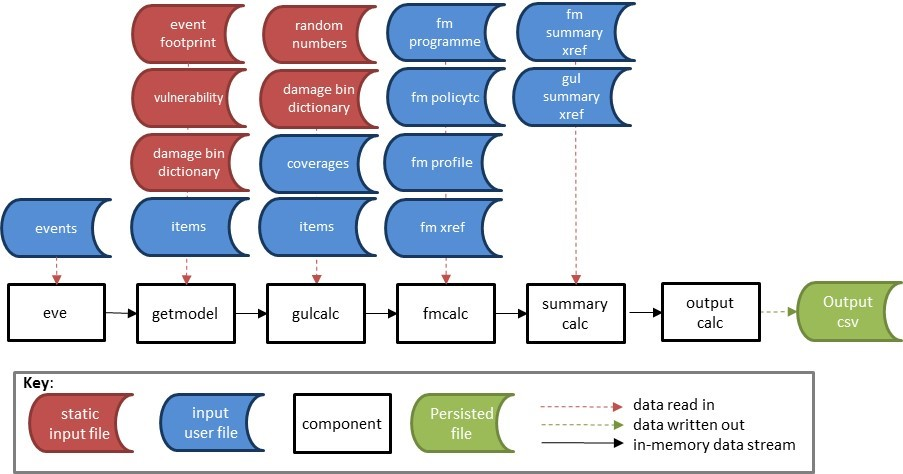

# Reference Model <a id="referencemodel"></a>

This section provides an explanation of the reference model, which is an implementation of each of the components in the framework. 

The set of core components provided in this release is as follows;
* **[eve](#eve)** is the event distributing utility. Based on the number of events in the input and the number of processes specified as a parameter, eve outputs subsets of the events as a stream. The output streams into getmodel.
* **[getmodel](#getmodel)** generates a stream of effective damageability cdfs for the input stream of events. The reference example generates these from the model files eventfootprint.bin and vulnerability.bin, and the user's exposures file which is called items.bin. getmodel streams into gulcalc or can be output to a binary file.
* **[gulcalc](#gulcalc)** performs the ground up loss sampling calculations and numerical integration. The output is the Oasis kernel gul sample table. This can be output to a binary file or streamed into  fmcalc or summarycalc.
* **[fmcalc](#fmcalc)** performs the insured loss calculations on the ground up loss samples and mean. The output is the Oasis format loss sample table. The result can be output to a binary file or streamed into summarycalc.
* **[summarycalc](#summarycalc)** performs a summing of sampled losses according to the user's reporting requirements.  For example this might involve summing coverage losses to regional level, or policy losses to portfolio level.  The output is sampled loss by event_id and summary_id, which represents a meaningful grouping of losses to the user. 

The following components are different implementations of **outputcalc**. The results are written directly into csv file as there is no downstream processing.

* **[eltcalc](#eltcalc)**  generates an event loss table from the sampled losses from summarycalc. It contains sample mean and standard deviation, and total exposed value for each event at the given summary level. 
* **[leccalc](#leccalc)**  generates loss exceedance curve from the sampled losses from summarycalc. There are 8 variants of curves with small differences in the output format but the common output fields are summary_id, return period, and loss exceedance threshold. This output is only available for models which provide an event **occurrence** file.
* **[pltcalc](#pltcalc)**  generates a period loss table from the sampled losses from summarycalc. It contains sample mean and standard deviation, and total exposed value for each event and each period (for example a year) at the given summary level. It also contains a date field, corresponding to the date of the event occurrence. This output is only available for models which provide an event **occurrence** file.
* **[aalcalc](#aalcalc)**  generates the average annual loss and standard deviation of loss from the sampled losses from summarycalc, for each summary_id. It also contains total exposed value for each summary level, which is the maximum of the total exposed value across all simulated periods. This output is only available for models which provide an event **occurrence** file.

Other components in the Reference Model include;
* **[Input conversion components](Inputtools.md)** to convert input data between csv and binary.
* **[Stream conversion components](Outputtools.md)** to convert the binary data stream output to csv.

Figure 1 shows the core data stream workflow of the reference model with its particular internal data files.

##### Figure 1. Core workflow and required data


The model / static data for the core workflow, shown as red source files, are the event footprint, vulnerability, damage bin dictionary and random number file.  These are stored in the 'static' sub-directory of the working folder.  

The user / analysis input data for the core workflow, shown as blue source files, are the events, items, coverages, fm programme, fm policytc, fm profile, fm xref, fm summary xref and gul summary xref files. These are stored in the 'input' sub-directory of the working folder. 

These are all Oasis kernel format data objects with fixed formats. Note that the events 

There are some further files required for the output components as shown in Figure 2.

##### Figure 2. Output workflows and required data


The following sections explain the usage and internal processes of each of the reference components. The standard input and output data streams for the components are generic and are covered in the Specification. The input data requirements are covered in [Input data components](Inputtools.md).

<a id="eve"></a>
## eve
eve takes as input a list of event ids in binary format and generates a partition of event ids as a binary data stream, according to the parameters supplied. 

##### Stream_id
None. The output stream is a simple list of event_ids (4 byte integers).

##### Parameters
* process number - determines which partition of events to output to a single process
* number of processes - determines the total number of partitions of events to distribute to processes

##### Usage
```
$ eve [parameters] > [output].bin
$ eve [parameters] | getmodel | gulcalc [parameters] > [stdout].bin
```

##### Example
```
$ eve 1 2 > events1_2.bin 
$ eve 1 2 | getmodel | gulcalc -S100 -i - > gulcalc.bin
```

In this example, the events from the file **events.bin** will be read into memory and the first half (partition 1 of 2) would be streamed out to binary file, or downstream to a single process calculation workflow.

##### Internal data
The program requires an event binary. The file is picked up from the **input** sub-directory relative to where the program is invoked and has the following filename;
* input/events.bin

The data structure of events.bin is a simple list of event ids (4 byte integers).

[Return to top](#referencemodel)

<a id="getmodel"></a>
## getmodel 

getmodel generates a stream of effective damageability distributions (cdfs) from an input list of events. Specifically, it combines the probability distributions from the model files, eventfootprint.bin and vulnerability.bin, to generate effectice damageability cdfs for the subset of exposures contained in the items.bin file and converts them into a binary stream. The source input data must have been generated as binary files by a separate program.

This is reference example of the class of programs which generates the damage distributions for an event set and streams them into memory. It is envisaged that model developers who wish to use the toolkit as a back-end calculator of their existing platforms can write their own version of getmodel, reading in their own source data and converting it into the standard output stream. As long as the standard input and output structures are adhered to, the program can be written in any language and read any input data.

##### Stream_id

| Byte 1 | Bytes 2-4 |  Description                                   |
|:-------|-----------|:-----------------------------------------------|
|    0   |     1     |  getmodel reference example                    |

##### Parameters
None

##### Usage
```
$ [stdin component] | getmodel | [stout component]
$ [stdin component] | getmodel > [stdout].bin
$ getmodel < [stdin].bin > [stdout].bin
```

##### Example
```
$ eve 1 1 | getmodel | gulcalc -r -S100 -i -
$ eve 1 1 | getmodel > damagecdf.bin
$ getmodel < events.bin > damagecdf.bin 
```

##### Internal data
The program requires the eventfootprint binary and index file for the model, the vulnerability binary model file, the items file representing the user's exposures. The files are picked up from sub-directories relative to where the program is invoked, named as follows;

* static/eventfootprint.bin
* static/eventfootprint.idx
* static/vulnerability.bin
* static/damage_bin_dict.bin
* input/items.bin

The getmodel output stream is ordered by event and streamed out in blocks for each event. 

##### Calculation
The program filters the eventfootprint file for all 'areaperil_id's which appear in the items file. This effectively selects the event footprints that affect the exposures, and discards the rest.  Similarly the program filters the vulnerability file for 'vulnerability_id's that appear in the items file. This removes damage distributions which are not relevant for the exposures. Then a cartesian product of the eventfootprint and vulnerability distributions is created for every combination of areaperil_id and vulnerability_id in the items file. The effective damage probabilities are calculated by a sum product of conditional damage probabilities with intensity probability for each event, areaperil, vulnerability combination and each damage bin.  The resulting discrete probability distributions are converted into discrete cumulative distribution functions 'cdfs'.  Finally, the damage bin mid-point from the damage bin dictionary is read in as a new field in the cdf stream as 'bin_mean'.  This field is the conditional mean damage for the bin and it is used to facilitate the calculation of mean and standard deviation in the gulcalc component. 

[Return to top](#referencemodel)

<a id="gulcalc"></a>
## gulcalc 
The gulcalc program performs Monte Carlo sampling of ground up loss and calculates mean and standard deviation by numerical integration of the cdfs. The sampling methodology of Oasis classic has been extended beyond linear interpolation to include bin value sampling and quadratic interpolation. This supports damage bin intervals which represent a single discrete damage value, and damage distributions with cdfs that are described by a piecewise quadratic function. 

##### Stream_id

| Byte 1 | Bytes 2-4 |  Description                                   |
|:-------|-----------|:-----------------------------------------------|
|    1   |     1     |  gulcalc reference example                     |

##### Parameters
The parameters are;
* -C chunk_id
* -S number of samples
* -R reconciliation mode (optional)
* -r read random numbers from file (optional)
* -L loss threshold (optional)
* -d output random numbers (optional)

##### Usage
```
$ [stdin component] | gulcalc [parameters] | [stout component]
$ [stdin component] | gulcalc [parameters] > [stdout].bin
$ gulcalc [parameters] < [stdin].bin > [stdout].bin
```

##### Example
```
$ eve 1 1 1 | getmodel 1 | gulcalc -C1 -S100 | fmcalc
$ eve 1 1 1 | getmodel 1 | gulcalc -C1 -S100 > gul_chunk1.bin
$ gulcalc -C1 -S100 < cdf_chunk1.bin > gul_chunk1.bin 
```

##### Internal data
The program requires the damage bin dictionary for the model and the exposure instance table, both as binary files. The files are picked up from the directory where the program is invoked and have the following filenames;
* damage_bin_dictionary.bin
* exposures.bin

If the user specifies -r as a parameter, then the program also picks up a random number file from the working directory. The filename is;
random_{chunk_id}.bin

##### Calculation
The program constructs a cdf for each item, based on matching the areaperil_id and vulnerability_id from the stdin and the exposure data. The stdin stream is a block of cdfs which are ordered by event_id, areaperil_id, vulnerability_id and bin_index asccending.

For each item cdf and for the number of samples specified, the program reads a random number from the random number file if the -r parameter is used and uses it to sample ground up loss from the cdf using one of three methods. If the -r parameter is not used, a random number is generated on the fly for each event and group of items which have a common group_id using the Mersenne twister psuedo random number generator (the default RNG of the C++ v11 compiler).

For a given damage interval corresponding to a cumulative probability interval that each random number falls within;
* If the conditional mean damage (of the cdf) is the mid-point of the damage bin interval (of the damage bin dictionary) then the gulcalc program performs linear interpolation. 
* If the conditional mean damage is equal to the lower and upper damage threshold of the damage bin interval (i.e the bin represents a damage value, not a range) then that value is sampled.
* Else, the gulcalc program performs quadrative interpolation.

An example of the three cases and methods is given below;
 
| bin_from | bin_to |  bin_mean | Method used             |
|:---------|--------|-----------| :-----------------------|
|    0.1   |  0.2   |    0.15   | Linear interpolation    |
|    0.1   |  0.1   |    0.1    | Sample bin value        |
|    0.1   |  0.2   |    0.14   | Quadratic interpolation |

Each sampled damage is multiplied by the item TIV and output to the stdout stream.

A second calculation which occurs in the gulcalc program is of the mean and standard deviation of ground up loss. For each cdf, the mean and standard deviation of damage is calculated by numerical integration of the effective damageability probability distribution and the result is multiplied by the item TIV. The results are output to the stdout stream as IDX=-1 (mean) and IDX=-2 (standard deviation), for each item and event.

[Return to top](#referencemodel)

<a id="fmcalc"></a>
## fmcalc 
fmcalc is the in-memory implementation of the Oasis Financial Module. It applies policy terms and conditions to the ground up losses and produces insured loss sample output.

##### Stream_id

| Byte 1 | Bytes 2-4 |  Description                                   |
|:-------|-----------|:-----------------------------------------------|
|    2   |     1     |  fmcalc reference example                      |

##### Parameters
There are no parameters as all of the information is taken from the gul stdout stream and internal data.

##### Usage
```
$ [stdin component] | fmcalc | [stout component]
$ [stdin component] | fmcalc > [stdout].bin
$ fmcalc < [stdin].bin > [stdout].bin
```

##### Example
```
$ eve 1 1 1 | getmodel 1 | gulcalc -C1 -S100 | fmcalc | outputcalc > output.csv
$ eve 1 1 1 | getmodel 1 | gulcalc -C1 -S100 | fmcalc > fm_chunk1.bin
$ fmcalc < gul_chunk1.bin > fm_chunk1.bin 
```

##### Internal data
The program requires the FM Instance data, which is the Oasis native format data tables which describe an insurance programme. This file is picked up from the fm subdirectory;

fm/fm_data.bin

##### Calculation
fmcalc performs the same calculations as the Oasis Financial Module in R1.5.  Information about the Oasis Financial Module can be found on the public area of the Oasis Loss Modelling Framework website, and detailed information and examples are available to Oasis community members in the members area.

[Return to top](#referencemodel)

<a id="outputcalc"></a>
## outputcalc 
The reference example of an output produces an event loss table 'ELT' for either ground up loss or insured losses.

##### Stream_id

There is no output stream_id, the results table is written directly to csv.

##### Parameters
There are no parameters as all of the information is taken from the input stream and internal data.

##### Usage
Either gulcalc or fmcalc stdout can be input streams to outputcalc
```
$ [stdin component] | outputcalc | [output].csv
$ outputcalc < [stdin].bin > [output].csv
```

##### Example
Either gulcalc or fmcalc stdout streams can be input streams to outputcalc. For example;
```
$ eve 1 1 1 | getmodel 1 | gulcalc -C1 -S100 | outputcalc > output.csv
$ eve 1 1 1 | getmodel 1 | gulcalc -C1 -S100 | fmcalc | outputcalc > output.csv
$ outputcalc < gul.bin > output.csv
$ outputcalc < fm.bin > output.csv
```

##### Internal data
The program requires the exposures.bin file, and for fmcalc input it requires an additional cross reference file to relate the output_id from the fm stdout stream (which represents an abstract grouping of exposure items) back to the original item_id. This file is picked up from the fm subdirectory;

fm/fmxref.bin

##### Calculation
The program sums the sampled losses from either gulcalc stream or fmstream across the portfolio/programme by event and sample, and then computes sample mean and standard deviation. It reads the TIVs from the exposure instance table and sums them for the group of items affected by each event.

[Return to top](#referencemodel)

[Go to Input data tools](Inputtools.md)

[Back to Contents](Contents.md)
