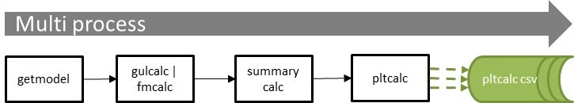
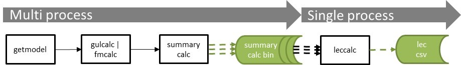

# Workflows

ktools is capable of multiple output workflows. This brings much greater flexibility, but also more complexity for users of the toolkit.  

This section presents some example workflows, starting with single output workflows and then moving onto more complex multi-output workflows. There are some python scripts provided which execute some of the illustrative workflows using the example data in the repository.  It is assumed that workflows will generally be run across multiple processes, with the number of processes being specified by the user.

### 1. Portfolio summary level insured loss event loss table

In this example, the core workflow is run through to fmcalc and then the losses are summarized by summary set 2, which is "portfolio" summary level.
This produces multiple output files when run with multiple processes, each containing a subset of the events.  The output files can be concatinated together at the end.
```
eve 1 2 | getmodel | gulcalc -r -S100 -i - | fmcalc | summarycalc -f -2 - | eltcalc > elt_p1.csv
eve 2 2 | getmodel | gulcalc -r -S100 -i - | fmcalc | summarycalc -f -2 - | eltcalc > elt_p2.csv
```

##### Figure 1. eltcalc workflow


See example script [eltcalc_example.py](../../examples/eltcalc_example.py)

### 2. Portfolio summary level insured loss period loss table

This is very similar to the first example, except the summary samples are run through pltcalc instead.  The output files can be concatinated together at the end.
```
eve 1 2 | getmodel | gulcalc -r -S100 -i - | fmcalc | summarycalc -f -2 - | pltcalc > plt_p1.csv
eve 2 2 | getmodel | gulcalc -r -S100 -i - | fmcalc | summarycalc -f -2 - | pltcalc > plt_p2.csv
```

##### Figure 2. pltcalc workflow


See example script [pltcalc_example.py](../../examples/eltcalc_example.py)

### 3. Portfolio summary level full uncertainty aggregate and occurrence loss exceedance curves

In this example, the summary samples are calculated as in the first two examples, but the results are output to the work folder.  Until this stage the calculation is ran over multiple processes. Then leccalc reads the summarycalc binaries from the work folder and computes two loss exceedance curves in a single process. Note that you can output all eight loss exceedance curve variants in a single leccalc command.
```
eve 1 2 | getmodel | gulcalc -r -S100 -i - | fmcalc | summarycalc -f -2 - > work/summary2/p1.bin
eve 2 2 | getmodel | gulcalc -r -S100 -i - | fmcalc | summarycalc -f -2 - > work/summary2/p1.bin
leccalc -Ksummary2 -F lec_full_uncertainty_agg.csv -f lec_full_uncertainty_occ.csv
```

##### Figure 3. leccalc workflow


See example script [leccalc_example.py](../../examples/leccalc_example.py)
